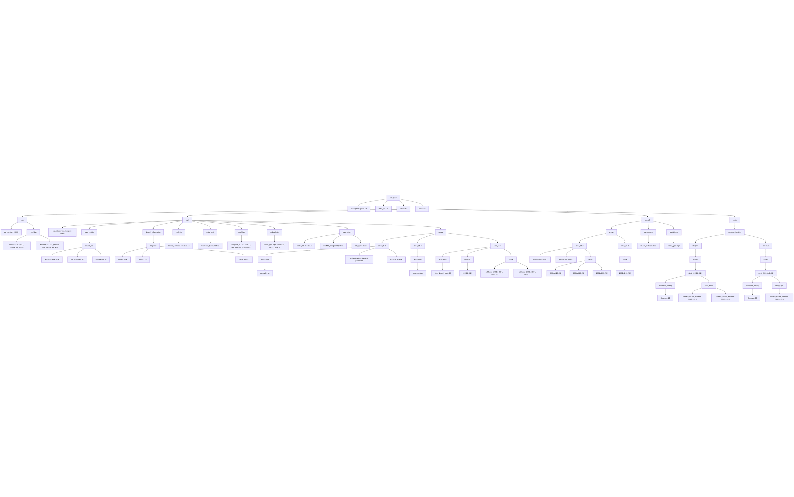

# 📦 Pull Request Documentation

## 🧾 Summary

<!-- Brief explanation of what this PR does and why. -->

This is a new Ansible module to manage VyOS VRF configuration as requested by https://vyos.dev/T6836

---

## 🔍 Implementation

<!-- Link to related issues or tasks -->

The module implements a set of VyOS 1.4.2 and 1.5.x commands related to VRF configuration, described in https://docs.vyos.io/en/1.4/configuration/vrf/index.html
The module allows to configure a global attribute (bind-all), as well as, VRF instance configuration.

The structure of the parameters is depicted below


The module supports the following states:

- "deleted"
- "merged"
- "replaced"
- "overridden"
- "gathered"
- "rendered"
- "parsed"

---

## 📐 Examples

### Replaced (to demo individual attribute processing)

Initial coonfiguration

````
 - set vrf bind-to-all
  - set vrf name vrf-blue description 'blue-vrf'
  - set vrf name vrf-blue table '100'
  - set vrf name vrf-blue vni '1000'
  - set vrf name vrf-red description 'red-vrf'
  - set vrf name vrf-red disable
  - set vrf name vrf-red ip disable-forwarding
  - set vrf name vrf-red ip protocol kernel route-map 'rm1'
  - set vrf name vrf-red ip protocol rip route-map 'rm1'
  - set vrf name vrf-red ipv6 nht no-resolve-via-default
  - set vrf name vrf-red table '101'
  - set vrf name vrf-red vni '1001'
  - set vrf name vrf-pink table 111
  - set vrf name vrf-pink vni 1111
  - set vrf name vrf-pink description pink-vrf
  - set vrf name vrf-pink protocols bgp system-as 65000
  - set vrf name vrf-pink protocols bgp neighbor 192.0.2.1 remote-as 65002
  - set vrf name vrf-pink protocols bgp neighbor 1.1.1.3 passive
  - set vrf name vrf-pink protocols bgp neighbor 1.1.1.3 remote-as 400
  - set vrf name vrf-pink protocols ospf log-adjacency-changes 'detail'
  - set vrf name vrf-pink protocols ospf max-metric router-lsa administrative
  - set vrf name vrf-pink protocols ospf max-metric router-lsa on-shutdown 10
  - set vrf name vrf-pink protocols ospf max-metric router-lsa on-startup 10
  - set vrf name vrf-pink protocols ospf default-information originate always
  - set vrf name vrf-pink protocols ospf default-information originate metric 10
  - set vrf name vrf-pink protocols ospf default-information originate metric-type 2
  - set vrf name vrf-pink protocols ospf mpls-te router-address '192.0.11.12'
  - set vrf name vrf-pink protocols ospf auto-cost reference-bandwidth '2'
  - set vrf name vrf-pink protocols ospf neighbor 192.0.11.12
  - set vrf name vrf-pink protocols ospf neighbor 192.0.11.12 poll-interval 10
  - set vrf name vrf-pink protocols ospf neighbor 192.0.11.12 priority 2
  - set vrf name vrf-pink protocols ospf redistribute bgp
  - set vrf name vrf-pink protocols ospf redistribute bgp metric 10
  - set vrf name vrf-pink protocols ospf redistribute bgp metric-type 2
  - set vrf name vrf-pink protocols ospf parameters router-id '192.0.1.1'
  - set vrf name vrf-pink protocols ospf parameters rfc1583-compatibility
  - set vrf name vrf-pink protocols ospf parameters abr-type 'cisco'
  - set vrf name vrf-pink protocols ospf area '2'
  - set vrf name vrf-pink protocols ospf area 2 area-type normal
  - set vrf name vrf-pink protocols ospf area 2 authentication plaintext-password
  - set vrf name vrf-pink protocols ospf area 2 shortcut enable
  - set vrf name vrf-pink protocols ospf area '3'
  - set vrf name vrf-pink protocols ospf area 3 area-type nssa
  - set vrf name vrf-pink protocols ospf area '4'
  - set vrf name vrf-pink protocols ospf area 4 area-type stub default-cost 20
  - set vrf name vrf-pink protocols ospf area 4 network 192.0.2.0/24
  - set vrf name vrf-pink protocols ospf area 4 range 192.0.3.0/24
  - set vrf name vrf-pink protocols ospf area 4 range 192.0.3.0/24 cost 10
  - set vrf name vrf-pink protocols ospf area 4 range 192.0.4.0/24
  - set vrf name vrf-pink protocols ospf area 4 range 192.0.4.0/24 cost 12
  - set vrf name vrf-pink protocols ospfv3 area '2'
  - set vrf name vrf-pink protocols ospfv3 area 2 export-list export1
  - set vrf name vrf-pink protocols ospfv3 area 2 import-list import1
  - set vrf name vrf-pink protocols ospfv3 area 2 range 2001:db10::/32
  - set vrf name vrf-pink protocols ospfv3 area 2 range 2001:db20::/32
  - set vrf name vrf-pink protocols ospfv3 area 2 range 2001:db30::/32
  - set vrf name vrf-pink protocols ospfv3 area '3'
  - set vrf name vrf-pink protocols ospfv3 area 3 range 2001:db40::/32
  - set vrf name vrf-pink protocols ospfv3 parameters router-id '192.0.2.10'
  - set vrf name vrf-pink protocols ospfv3 redistribute bgp
  - set vrf name vrf-pink protocols static route 192.0.2.0/24
  - set vrf name vrf-pink protocols static route 192.0.2.0/24 blackhole distance '10'
  - set vrf name vrf-pink protocols static route 192.0.2.0/24 next-hop '203.0.113.1'
  - set vrf name vrf-pink protocols static route 192.0.2.0/24 next-hop '203.0.113.2'
  - set vrf name vrf-pink protocols static route6 2001:db8::/32
  - set vrf name vrf-pink protocols static route6 2001:db8::/32 blackhole distance '20'
  - set vrf name vrf-pink protocols static route6 2001:db8::/32 next-hop '2001:db8::1'

Module configuration
```yaml
      vyos.vyos.vyos_vrf:
        config:
          instances:
            - name: "vrf-blue"
              description: "blue-vrf"
              disable: true
              table_id: 100
              vni: 1000
            - name: "vrf-red"
              description: "Vermillion_VRF"
              disable: false
              table_id: 101
              vni: 1011
              address_family:
                - afi: "ipv6"
                  nht_no_resolve_via_default: false
            - name: "vrf-pink"
              table_id: 111
              protocols:
                ospf:
                  default_information:
                    originate:
                      always: true
                      metric: 20
                      metric_type: 1
        state: replaced

Will result in

````

- delete vrf bind-to-all
- set vrf name vrf-blue disable
- set vrf name vrf-red vni 1011
- set vrf name vrf-red description Vermillion_VRF
- delete vrf name vrf-red disable
- delete vrf name vrf-red ipv6 nht no-resolve-via-default
- delete vrf name vrf-pink vni 1111
- delete vrf name vrf-pink description pink-vrf
- delete vrf name vrf-pink protocols ospf log-adjacency-changes 'detail'
- delete vrf name vrf-pink protocols ospf auto-cost
- delete vrf name vrf-pink protocols ospf max-metric
- delete vrf name vrf-pink protocols ospf mpls-te
- delete vrf name vrf-pink protocols ospf area
- delete vrf name vrf-pink protocols ospf parameters
- delete vrf name vrf-pink protocols ospf neighbor
- delete vrf name vrf-pink protocols ospf redistribute
- set vrf name vrf-pink protocols ospf default-information originate metric 20
- set vrf name vrf-pink protocols ospf default-information originate metric-type 1

---
